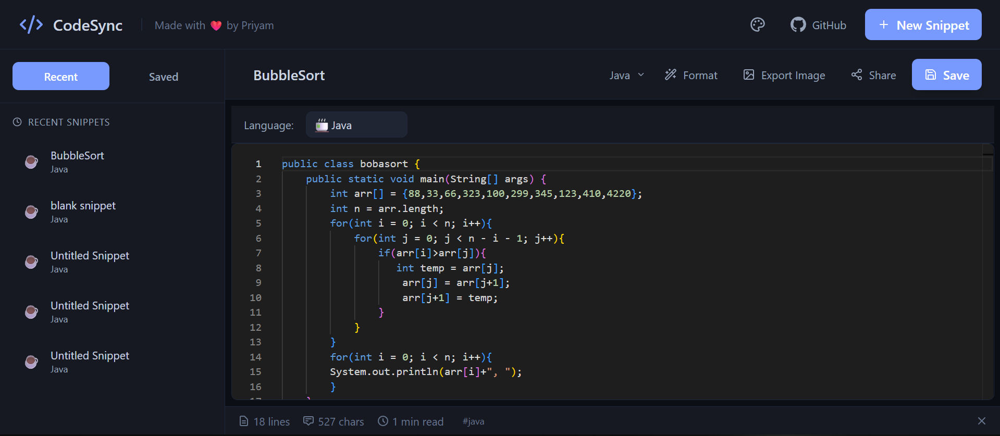
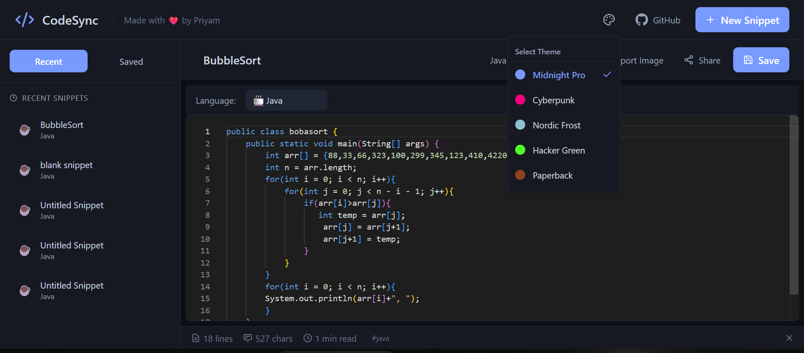
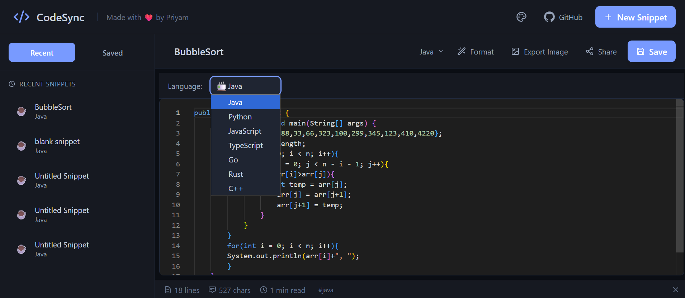
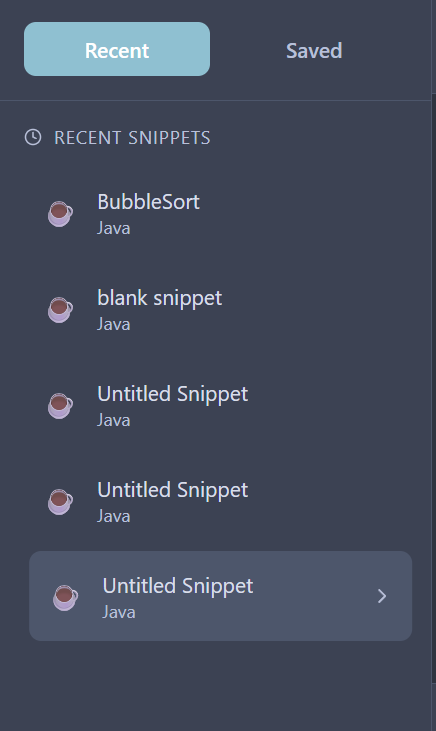

# CodeSync

A modern, beautiful code snippet sharing tool built for developers. Save, organize, and share your code snippets with a professional IDE-like experience.



## Features

### Theme System
Choose from 5 professional themes designed to match your workflow:

- **Midnight Pro** - Deep navy with soft blue accent for late-night coding sessions
- **Cyberpunk** - Dark purple with neon pink/cyan accents for a high-tech feel
- **Nordic Frost** - Cool grays with ice blue for a calm, sophisticated look
- **Hacker Green** - Classic terminal-inspired matrix green on black
- **Paperback** - Warm cream tones for easy reading in bright environments



### Code Editor
- Syntax highlighting for 7+ languages (Java, JavaScript, TypeScript, Python, C++, Go, Rust)
- Auto-detection of programming language
- Code formatting with Prettier
- Line numbers and character count
- Estimated reading time



### Snippet Management
- Save snippets to Supabase cloud storage
- Local storage fallback when offline
- Quick access to recent snippets
- Organized sidebar navigation
- Shareable short links for any snippet



### Export Options
- Copy snippet as image (perfect for social media)
- Copy shareable link to clipboard
- Export with syntax highlighting preserved

### Keyboard Shortcuts
- `Ctrl/Cmd + S` - Save snippet
- `Ctrl/Cmd + F` - Format code

### Additional Features
- Responsive design for all screen sizes
- Smooth animations powered by Framer Motion
- Collapsible sidebar for maximum editor space
- GitHub integration

## Tech Stack

- **React** - UI library
- **Vite** - Build tool
- **Tailwind CSS** - Styling with CSS variables for theming
- **Framer Motion** - Animations
- **Lucide React** - Icons
- **Supabase** - Backend storage
- **CodeMirror** - Code editor
- **Prettier** - Code formatting
- **html-to-image** - Image export
- **LZ-String** - Compression

## Setup

### Prerequisites

- Node.js 18+ and npm
- A Supabase account (free tier works)

### Installation

1. **Clone the repository**
   ```bash
   git clone https://github.com/priyam1234-spec/codesync-ui.git
   cd codesync-ui
   ```

2. **Install dependencies**
   ```bash
   npm install
   ```

3. **Set up Supabase**

   a. Create a new project at [supabase.com](https://supabase.com)

   b. Create a table named `snippets` with the following schema:
   ```sql
   create table snippets (
     id uuid default gen_random_uuid() primary key,
     title text,
     code text,
     language text,
     created_at timestamptz default now(),
     updated_at timestamptz default now()
   );
   ```

   c. Get your credentials from Settings > API

4. **Configure environment variables**

   Create a `.env` file in the root directory:
   ```env
   VITE_SUPABASE_URL=your-project-url
   VITE_SUPABASE_ANON_KEY=your-anon-key
   ```

5. **Start the development server**
   ```bash
   npm run dev
   ```

6. **Open in browser**
   Navigate to `http://localhost:5173`

### Build for Production

```bash
npm run build
npm run preview
```

## Project Structure

```
codesync-ui/
├── src/
│   ├── components/       # React components
│   │   ├── Header.jsx
│   │   ├── Sidebar.jsx
│   │   ├── CodeEditor.jsx
│   │   ├── EditorToolbar.jsx
│   │   ├── ConsolePanel.jsx
│   │   ├── Toast.jsx
│   │   └── ThemeSelector.jsx
│   ├── lib/              # Utility functions
│   │   ├── snippetStorage.js
│   │   └── supabase.js
│   ├── App.jsx           # Main app component
│   ├── main.jsx          # Entry point
│   └── index.css         # Global styles & themes
├── public/               # Static assets
├── package.json
└── vite.config.js
```

## Configuration

### Adding Custom Themes

Edit `src/index.css` and add a new theme block:

```css
[data-theme="your-theme"] {
  --bg-primary: #000000;
  --bg-secondary: #1a1a1a;
  --text-primary: #ffffff;
  --accent: #your-color;
  /* ... other variables */
}
```

Then add it to the theme selector in `src/components/ThemeSelector.jsx`.

## Browser Support

- Chrome (latest)
- Firefox (latest)
- Safari (latest)
- Edge (latest)

## Contributing

Contributions are welcome! Please feel free to submit a Pull Request.

1. Fork the repository
2. Create your feature branch (`git checkout -b feature/amazing-feature`)
3. Commit your changes (`git commit -m 'Add amazing feature'`)
4. Push to the branch (`git push origin feature/amazing-feature`)
5. Open a Pull Request

## License

This project is open source and available under the [MIT License](LICENSE).

## Acknowledgments

- Built with [React](https://react.dev/)
- Styled with [Tailwind CSS](https://tailwindcss.com/)
- Icons by [Lucide](https://lucide.dev/)
- Powered by [Supabase](https://supabase.com/)

---

**Made with ❤️ by Priyam**

[GitHub](https://github.com/priyam1234-spec)
